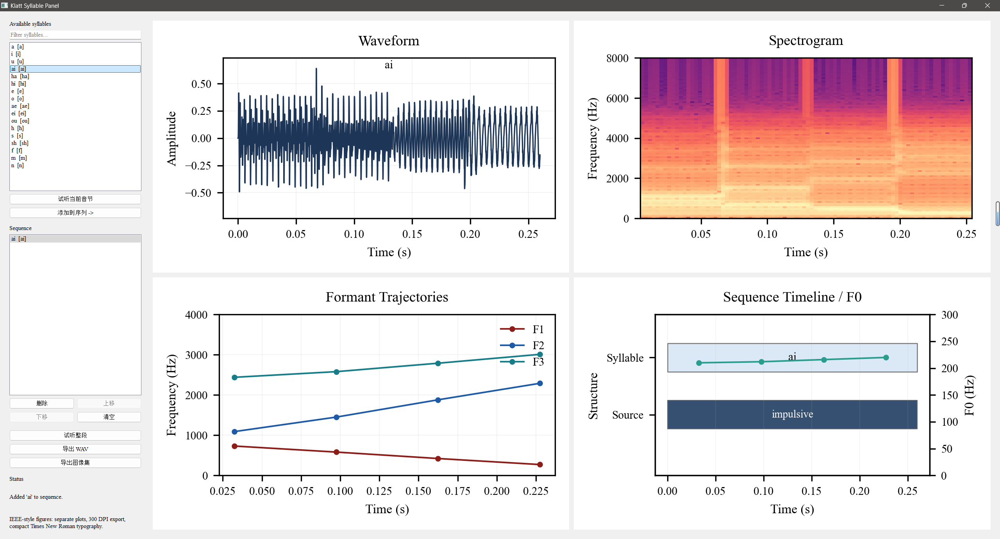

<div align="center">

# DSP Speech Syllable Synthesis and Analysis System Based on the Klatt Formant Model

**A Python + PyQt5 DSP course project for syllable-level speech synthesis, interactive composition, and report-ready acoustic visualization.**

</div>

## Overview

This project rebuilds the classic **Klatt formant synthesizer** in pure Python and extends it into a complete DSP course demo system. It is designed for **transparent speech synthesis experiments** rather than black-box text-to-speech.

The system supports:

- parameter-driven speech synthesis based on the **source-filter model**
- **vowels, diphthongs, consonants, and syllable fragments** defined as reusable presets
- a **PyQt5 GUI panel** for selecting and concatenating syllables
- **WAV export** for listening experiments
- **IEEE-style figure export** for technical reports and course writeups

Unlike neural TTS pipelines, every important acoustic quantity in this project is explicit and inspectable: `F0`, formant frequencies, bandwidths, glottal source type, aspiration, spectral tilt, and crossfade transitions.

## GUI Preview



## Key Features

### 1. Classical DSP speech synthesis
- Klatt **cascade / parallel formant synthesis** core
- impulsive, natural, and noise-based excitation sources
- aspiration, frication, breathiness, flutter, spectral tilt, and nasal effects

### 2. Syllable-level preset library
The system currently includes a preset library covering:

- Vowels: `a`, `i`, `u`, `e`, `o`, `ae`
- Diphthongs: `ai`, `ei`, `ou`
- Complete syllables: `ha`, `hi`
- Consonant or consonant-like segments: `h`, `s`, `sh`, `f`, `m`, `n`

These presets can be used directly in the GUI or combined manually into short syllable sequences such as:

- `h + ai`
- `s + a`
- `sh + i`
- `m + ou`

### 3. Report-ready visualization
The GUI exports four **separate IEEE-style figures** at **300 DPI** with **Times New Roman** formatting:

- waveform
- spectrogram
- formant trajectories (`F1`, `F2`, `F3`)
- sequence timeline with excitation type and `F0`

This makes the project suitable not only for synthesis experiments, but also for **DSP course reports, demonstrations, and presentations**.

## Project Architecture

The project is organized into four layers:

| Layer | Purpose |
| --- | --- |
| `klatt_syn/klatt.py` | Low-level DSP implementation of the Klatt synthesizer |
| `klatt_syn/syllables.py` | JSON preset loading, syllable rendering, sequence rendering, WAV export |
| `klatt_syn/visualization.py` | IEEE-style waveform / spectrogram / formant / timeline plotting |
| `app/pyqt_panel.py` | PyQt5 graphical interface for composition, preview, export |

This separation keeps the project modular and makes it easy to extend either the signal-processing layer or the GUI layer.

## Repository Structure

```text
klatt-syn-python/
├── app/
│   └── pyqt_panel.py
├── assets/
│   └── gui-panel.png
├── examples/
│   └── generate_demo.py
├── klatt_syn/
│   ├── klatt.py
│   ├── syllables.py
│   ├── visualization.py
│   └── demo_params.py
├── presets/
│   └── syllables.json
├── reports/
│   ├── DSP课程_技术报告.md
│   └── DSP课程_研究报告.md
├── tests/
│   └── test_syllables.py
├── pyproject.toml
└── README.md
```

## Quick Start

### Requirements

- Python `>= 3.10`
- PyQt5
- matplotlib
- numpy

Install dependencies if needed:

```powershell
cd W:\Research_Competitions\Learning\Digital_Signal_Processor\klatt-syn-python
python -m pip install PyQt5 matplotlib numpy
```

### Run the GUI panel

```powershell
cd W:\Research_Competitions\Learning\Digital_Signal_Processor\klatt-syn-python
python .\app\pyqt_panel.py
```

### Run the audio demo

```powershell
cd W:\Research_Competitions\Learning\Digital_Signal_Processor\klatt-syn-python
python .\examples\generate_demo.py
```

### Run tests

```powershell
cd W:\Research_Competitions\Learning\Digital_Signal_Processor\klatt-syn-python
python -m unittest discover -s tests -v
```

## How to Use the GUI

1. Select a preset from the **Available syllables** list.
2. Preview the selected syllable.
3. Add one or more presets into the **Sequence** list.
4. Reorder or remove sequence items as needed.
5. Preview the full sequence.
6. Export:
   - `WAV` audio
   - four independent IEEE-style report figures

If the sequence is empty, the visualization area shows the currently selected syllable. Once a sequence is built, the plots automatically switch to the full composed sequence.

## Programmatic Usage

```python
from klatt_syn import DEFAULT_LIBRARY_PATH, load_syllable_library, render_sequence

library = load_syllable_library(DEFAULT_LIBRARY_PATH)
hi = library.get_preset("hi")
samples = render_sequence([hi, hi], sample_rate=library.sample_rate)
```

## DSP Concepts Demonstrated

This project is especially suitable for coursework involving:

- source-filter speech production modeling
- IIR resonators and anti-resonators
- time-varying spectral envelopes
- formant-based vowel synthesis
- fricative / nasal acoustic modeling
- time-frequency analysis of speech-like signals
- practical GUI-based DSP experimentation

## Reports

Two course-oriented Markdown reports are included in [reports](reports/):

- `DSP课程_技术报告.md`: engineering architecture, implementation, testing, and system design
- `DSP课程_研究报告.md`: research motivation, theoretical basis, experiment design, and analysis ideas

## Why This Project Matters

Most modern speech systems are powerful but difficult to explain in a classroom setting. This project focuses on the opposite goal:

- **high interpretability**
- **explicit acoustic parameters**
- **direct connection to DSP theory**
- **easy export of figures for documentation**

That makes it a strong fit for **DSP coursework, technical presentations, and reproducible speech experiments**.

## Acknowledgment

This project is inspired by the TypeScript implementation [`chdh/klatt-syn`](https://github.com/chdh/klatt-syn), which itself follows the classic Klatt cascade-parallel formant synthesis framework.
